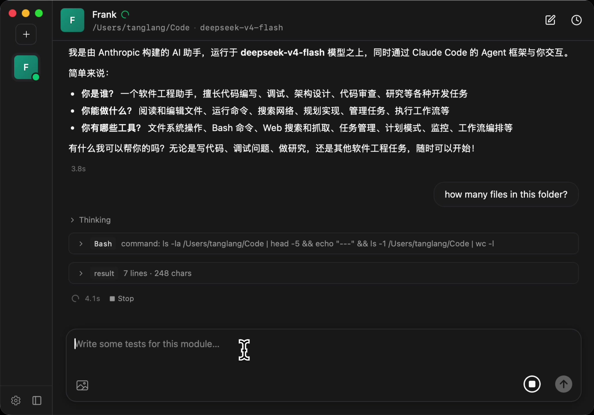

# Bunshin

**Skip the terminal. Put Claude Code to work.**

A desktop app for Claude Code — plug in any Anthropic-compatible API, point an agent
at a folder, and let it work. No command line, no setup ceremony.

[**Website**](https://bunshin.app) · [**Download for macOS**](https://github.com/frankkk96/bunshin-desktop/releases/latest/download/Bunshin-macOS.dmg) · [**Download for Windows**](https://github.com/frankkk96/bunshin-desktop/releases/latest/download/Bunshin-Windows-setup.exe) — free, bring your own API keys



## Features

- **Scoped to your code** — every agent pairs a working directory with a model.
- **Bring your own model** — Claude, DeepSeek, Qwen, GLM, MiniMax, Kimi, billed to you.
- **Tools with guardrails** — Bash, Edit, web, MCP, sub-agents, with permission modes.
- **Local-first** — conversations, configs, and keys live in a local SQLite file.

## Development

Built on [Tauri v2](https://tauri.app) (React + Vite + Rust). Requires Node.js (LTS)
and the Rust toolchain.

```bash
npm install        # install dependencies
npm run tauri dev  # run in development
npm run tauri build  # production build
```

### Bundled Claude Code

The Claude Code binary ships **inside** the app as a Tauri sidecar, so end users
never install anything. The pinned version lives in
[`src-tauri/claude-code-version`](src-tauri/claude-code-version); `npm run tauri dev`
and `tauri build` auto-download the matching binary for your platform on first run
(~210 MB, checksum-verified, cached under `src-tauri/binaries/`, which is gitignored).
Run it manually with `npm run fetch:claude`. To upgrade Claude Code, bump that
version file and cut a new Bunshin release. The macOS release build is universal
(arm64 + x86_64 combined via `lipo`).

## Releases

Pushing a `v*` tag runs the [`publish`](.github/workflows/publish.yml) workflow, which
builds signed macOS and Windows artifacts and a `latest.json` manifest for the in-app
auto-updater. The download links above always resolve to the newest release.
